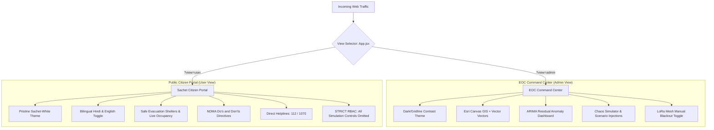

# Citizen Portal vs. EOC Command Center: Architectural Separation & Disaster Ethics

**System:** TERRA SHIELD Multi-Tenant UI/UX Framework  
**Front-End Stack:** React 19 + Vite + Vanilla CSS (Watermelon UI Gridline & Sachet NDMA Design)  
**Problem Statement:** SIH26178 | **Theme:** Disaster Management  

---

## 1. Executive Summary & Design Philosophy

Emergency disaster management requires two distinct, non-overlapping user experiences:
1. **The Emergency Operations Center (EOC) Command Center (`currentView === 'ADMIN'`):**
   Engineered for district collectors, NDRF commanders, and hydrological engineers who require deep telemetry, ARIMA residual parameters, network topology diagnostics, and **simulation injection tools** to test response drills.
2. **The Sachet-Inspired Bilingual Citizen Portal (`currentView === 'USER'`):**
   Engineered for ordinary citizens seeking clear, calm, and actionable safety guidance during an active disaster: safe shelter locations, current water danger stages, and direct SOS helplines—**with all simulation tools strictly prohibited**.



---

## 2. In-Depth Analysis: Why Citizen Portal Has No Simulate Option

One of the most vital questions in disaster software governance is:  
**"Why does the Citizen Portal have no simulation option?"**

The answer lies in strict adherence to National Disaster Management Authority (NDMA) safety guidelines, human behavioral psychology during crises, and standard security engineering.

---

### 2.1. Prevention of Mass Panic & False Rumors
In a real disaster or tense weather advisory period:
- If a curious citizen visits the portal, clicks *"Simulate Flash Flood"*, the screen turns red, sirens pulse, and simulated water levels surge to 4.8 meters.
- The citizen captures a screenshot and forwards it onto local WhatsApp, Telegram, or Twitter groups with the caption: *"BREAKING: River overflowing, evacuate now!"*
- Within minutes, thousands of residents attempt simultaneous evacuation across vulnerable bridges, creating highway gridlock, preventing NDRF rescue vehicles from moving, and causing fatal stampedes.

**Design Rule:** A public emergency system must **never** permit non-authenticated users to manipulate or inject simulated crisis telemetry into public-facing views.

---

### 2.2. Helpline & First-Responder Paralysis
When citizens see simulated disaster alerts:
- Local police control rooms (112), State Disaster Management helplines (1070), and fire departments receive thousands of panic calls within minutes.
- Real distress calls from individuals suffering medical emergencies or localized drownings are drowned out by operator busy signals.

---

### 2.3. Role-Based Access Control (RBAC) Implementation in TERRA SHIELD

In `frontend/src/components/Navbar.jsx`, TERRA SHIELD enforces programmatic RBAC segregation between views:

```jsx
{/* Right Actions - Conditionally Rendered by View Role */}
<div style={{ display: 'flex', alignItems: 'center', gap: '8px' }}>
  {currentView === 'USER' ? (
    /* Public Citizen Safe Badges (Zero Simulation Triggers) */
    <div style={{ display: 'flex', alignItems: 'center', gap: '8px' }}>
      <span className="citizen-badge-call">
        <PhoneCall size={12} />
        24x7 SOS: 112 / 1070
      </span>
      <span className="citizen-badge-verified">
        <ShieldCheck size={12} />
        NDMA Verified
      </span>
    </div>
  ) : (
    /* EOC Admin Command Controls */
    <div style={{ display: 'flex', alignItems: 'center', gap: '8px' }}>
      <button 
        className="btn-command"
        onClick={() => setShowSimulation(true)}
      >
        <Zap size={14} />
        Simulate Scenario
      </button>
      <button 
        className="btn-command"
        onClick={handleToggleMeshFailover}
      >
        <Radio size={14} />
        LoRa Mesh Failover
      </button>
    </div>
  )}
</div>
```

---

## 3. Comparative Experience Matrix

| Component / Feature | Sachet Citizen Portal (`USER`) | EOC Command Center (`ADMIN`) |
| :--- | :--- | :--- |
| **Visual Aesthetic** | Pristine White background, high-readability typography, official government footer. | Watermelon UI Gridline, high-contrast dark accents, dense data readouts. |
| **Language Localization** | Full dynamic Hindi (हिंदी) and English toggle with native transliteration. | English operational technical nomenclature. |
| **Sensor Telemetry Depth** | Simplified status: *"Safe"*, *"Alert"*, *"Danger"* with intuitive color bars. | Raw ultrasonic meters, rate of change ($\text{m}/30\text{min}$), MPU-6050 tilt degrees, battery %, RSSI. |
| **Forecasting Engine** | Simplified 3-hour projection bar with actionable advice. | Full ARIMA(2,1,1) coefficients, baseline $\hat{Y}$, residual $e_t$, and Anomaly $Z$-Score. |
| **Evacuation Shelter Map** | Prominent interactive map markers with capacity and open/closed occupancy status. | Aggregated shelter logistics panel within EOC incident dispatch view. |
| **Simulation Controls** | **Completely Excluded (Omitted from DOM).** | **Full Access:** Flash Flood, Wildfire, Pollution, and Cellular Blackout injections. |
| **Mesh Failover Trigger** | Read-only indicator: *"Mesh Active (Offline Mode)"*. | Interactive toggle button for drill and disaster failover testing. |
