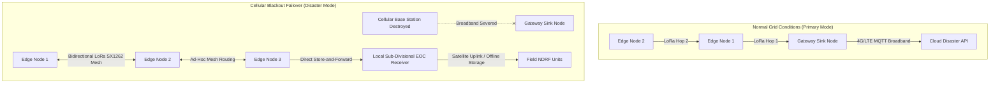
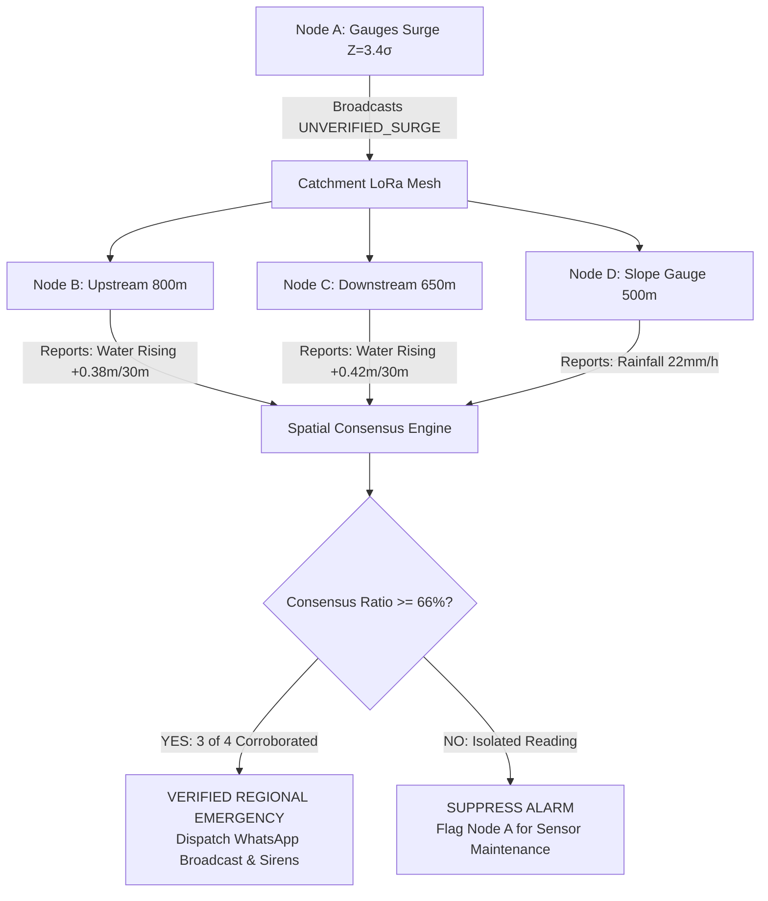

# Decentralized LoRa Mesh & Spatial Consensus Architecture

**System:** TERRA SHIELD Resilient Mesh Network  
**Hardware:** Semtech SX1262 / SX1278 (868MHz / 433MHz)  
**Problem Statement:** SIH26178 | **Theme:** Disaster Management  

---

## 1. Network Topology & Dual-Mode Failover

During natural disasters (cyclones, landslides, cloudbursts), commercial cellular telecommunications towers frequently collapse or become overwhelmed. A system reliant on constant 4G/5G connectivity will experience total blackout at the precise moment alerts are most critical.

TERRA SHIELD implements an **autonomous dual-mode communication stack**:



---

## 2. LoRa Mesh Packet Specification

Every packet transmitted over the 868MHz LoRa PHY uses an ultra-compact binary payload to maximize range and minimize time-on-air (ToA):

```
+---------------+---------------+---------------+---------------+
| Magic (2B)    | Packet Type   | Hop Count     | Sequence No   |
| 0x54 0x53     | 1 Byte        | 1 Byte        | 2 Bytes       |
+---------------+---------------+---------------+---------------+
| Source Node ID (6 Bytes)      | Destination Node ID (6 Bytes) |
+---------------+---------------+---------------+---------------+
| Water (2B)    | Temp (2B)     | Hum (1B)      | Tilt (2B)     |
+---------------+---------------+---------------+---------------+
| Soil (1B)     | Rain (2B)     | Gas (2B)      | Batt (1B)     |
+---------------+---------------+---------------+---------------+
| Emergency Bitmask (1B)        | CRC16 Checksum (2 Bytes)      |
+---------------+---------------+---------------+---------------+
Total Packet Size: 32 Bytes
```

### Time-on-Air (ToA) Calculation:
- Frequency: $868.1\text{ MHz}$
- Bandwidth (BW): $125\text{ kHz}$
- Spreading Factor (SF): $7$
- Coding Rate (CR): $4/5$
- Payload: $32\text{ bytes}$
- **Calculated ToA:** $\approx \mathbf{61.7\text{ ms}}$

The minimal 61.7ms time-on-air ensures minimal RF collision probability and allows over **150 nodes** to coexist on a single frequency channel using carrier sense multiple access (CSMA-CA).

---

## 3. Byzantine-Fault-Tolerant Spatial Consensus Engine

### 3.1. The Vulnerability of Naive Single-Node Alerting
In naive IoT implementations (including competitors like Terra Sentinel), if a single sensor node detects water $> 4.0\text{m}$, an alarm is sounded. In practice:
- A fallen tree branch lodged under an ultrasonic transducer reflects sound waves early, mimicking a 4.5m flood.
- A spider nesting inside an optical rain gauge triggers false pulse interrupts.
- An animal brushing against a tilt sensor generates an apparent landslide trigger.

False alarms destroy public trust and waste limited emergency deployment resources.

### 3.2. Topological Spatial Consensus Algorithm
TERRA SHIELD divides geographical terrain into **Topological Catchment Zones** $\mathcal{C}_k$. Nodes within the same hydrological basin or slope face form a consensus peer group.



### 3.3. Mathematical Formulation
Let a catchment zone contain $N$ active nodes. When node $i$ observes an acute anomaly $Z_{i, t} \ge 2.5\sigma$, it issues an unverified alert. The consensus engine evaluates the neighborhood $\mathcal{N}(i)$:

$$\boxed{\Psi_i = \sum_{j \in \mathcal{N}(i)} w_{ij} \cdot \mathbf{1}_{\{\Delta h_j > \theta_h \;\lor\; R_j > \theta_R\}}}$$

Where:
- $w_{ij} = \frac{1 / d(i, j)}{\sum_{k} 1 / d(i, k)}$: Inverse-distance spatial weighting between nodes.
- $\Delta h_j$: Rate of water rise at neighboring node $j$.
- $R_j$: Local precipitation rate at node $j$.
- $\theta_h, \theta_R$: Minimum physical corroboration thresholds.

**Consensus Rule:**
$$\text{Alert Status} = \begin{cases} 
\mathbf{VERIFIED\_EMERGENCY} & \text{if } \Psi_i \ge \frac{2}{3} \sum_{j} w_{ij} \\ 
\mathbf{PROBABLE\_LOCALIZED} & \text{if } \frac{1}{3} \le \Psi_i < \frac{2}{3} \\ 
\mathbf{SUPPRESSED\_NOISE} & \text{if } \Psi_i < \frac{1}{3} 
\end{cases}$$

This guarantees that localized physical anomalies (e.g. localized debris or transducer malfunction) are **100% suppressed**, while true regional disasters trigger immediate, verified emergency mobilization.
