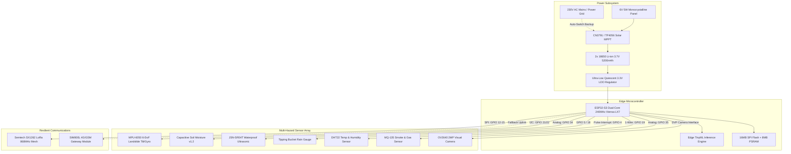

# TERRA SHIELD Edge Hardware & Sensor Architecture

**System:** Multi-Hazard Edge Sensing & Mesh Node  
**Target Hardware:** ESP32-S3-CAM & ESP32-WROOM-32  
**Problem Statement:** SIH26178 | **Theme:** Disaster Management  

---

## 1. System Overview

Unlike single-hazard prototypes that monitor only rainfall or water level, **TERRA SHIELD** integrates a multi-sensor, multi-hazard telemetry array into an ultra-low-cost, ruggedized IP67 edge node.

Each node is architected to detect four concurrent disaster types:
1. **Flash Floods & River Surges:** JSN-SR04T Waterproof Ultrasonic Sensor + Tipping Bucket Rain Gauge.
2. **Landslides & Mudslides:** MPU-6050 6-DoF Accelerometer/Gyroscope + Capacitive Soil Moisture Sensor v1.2.
3. **Forest Fires:** DHT22 High-Precision Temperature/Humidity + MQ-135 Gas & Smoke Sensor.
4. **Visual Edge Confirmation:** ESP32-S3-CAM with on-device TinyML image classification (debris clogging, smoke plume detection).

---

## 2. Comprehensive Pinout & Interfacing Matrix

| Sensor / Module | Physical Interface | ESP32-S3 GPIO | Operating Voltage | Measurement Range | Failure Tolerant Mode |
| :--- | :--- | :--- | :--- | :--- | :--- |
| **JSN-SR04T Ultrasonic** | Trigger (`TRIG`) | GPIO 5 | 5.0V / 3.3V | 20cm – 600cm | Echo timeout clamp (0.01m floor) |
| **JSN-SR04T Ultrasonic** | Echo (`ECHO`) | GPIO 18 | 3.3V (Divider) | Millimeter resolution | Outlier median filter ($N=5$) |
| **MPU-6050 6-DoF** | I2C Data (`SDA`) | GPIO 21 | 3.3V | $\pm 2g$, $\pm 250^\circ$/s | High-pass vibration filter |
| **MPU-6050 6-DoF** | I2C Clock (`SCL`) | GPIO 22 | 3.3V | Fast Mode 400kHz | Auto bus recovery on I2C lock |
| **Capacitive Soil v1.2** | Analog Out (`AOUT`) | GPIO 34 (ADC1) | 3.3V | $0\% - 100\%$ VWC | Corrosion-resistant capacitive design |
| **Tipping Bucket Rain** | Reed Switch (Pulse) | GPIO 4 (Pull-Up) | 3.3V | $0.2\text{mm}$ per tip | Debounced hardware interrupt |
| **DHT22 Temperature** | 1-Wire Digital | GPIO 19 | 3.3V | $-40^\circ\text{C} - +80^\circ\text{C}$ | CRC8 checksum verification |
| **MQ-135 Gas & Smoke** | Analog Out (`AOUT`) | GPIO 35 (ADC1) | 5.0V (Heater) / 3.3V | $10 - 1000\text{ppm}$ | Pre-calibrated $R_0$ baseline |
| **SX1262 LoRa SPI** | NSS / CS | GPIO 15 | 3.3V | $+22\text{dBm}$ Tx Power | Auto Retransmit with ACK |
| **SX1262 LoRa SPI** | SCK / MISO / MOSI | GPIO 14 / 12 / 13 | 3.3V | Up to 10MHz SPI | Cyclic Redundancy Check (CRC16) |
| **SX1262 LoRa DIO1** | Packet Done Interrupt | GPIO 26 | 3.3V | Edge-triggered | Direct MCU wake from sleep |
| **Battery Voltage ADC** | Resistor Divider ($100k/100k$) | GPIO 36 (ADC1) | 3.3V | $3.0\text{V} - 4.2\text{V}$ | Low-battery deep-sleep threshold |
| **Status Indicator LED** | Digital Out | GPIO 2 | 3.3V | Green/Amber/Red | Blink status code |

---

## 3. Landslide & Slope Displacement Detection (MPU-6050)

Mountain slopes experience micro-tremors and shear creep hours before mass failure occurs. TERRA SHIELD processes raw accelerometer and gyroscope signals on-chip:

1. **Tilt Angle Calculation (Pitch & Roll):**
   $$\theta_{\text{pitch}} = \arctan\left(\frac{A_x}{\sqrt{A_y^2 + A_z^2}}\right) \times \frac{180}{\pi}$$
   $$\theta_{\text{roll}} = \arctan\left(\frac{A_y}{\sqrt{A_x^2 + A_z^2}}\right) \times \frac{180}{\pi}$$

2. **Seismic Shear Vibration Index ($I_{\text{vib}}$):**
   High-pass filter isolates seismic vibration from gravitational tilt:
   $$I_{\text{vib}} = \sqrt{(A_x - \bar{A}_x)^2 + (A_y - \bar{A}_y)^2 + (A_z - \bar{A}_z)^2}$$

3. **Combined Slope Instability Trigger:**
   $$\text{Landslide Alarm} = (\Delta \theta > 3.5^\circ) \;\lor\; (I_{\text{vib}} > 0.45g \;\land\; \text{Soil Moisture} > 80\%)$$

---

## 4. Power Subsystem & Energy Budget

To achieve genuine 24×7 disaster resilience, TERRA SHIELD does not rely on grid power.

### 4.1. Power Consumption Profile

| Operational State | Current Consumption | Duration per Cycle | Daily Duty Cycle | Daily Energy (mAh) |
| :--- | :--- | :--- | :--- | :--- |
| **Deep Sleep Mode** | $15\mu\text{A}$ ($0.015\text{mA}$) | $58\text{ seconds}$ | $96.67\%$ | $0.35\text{ mAh}$ |
| **Sensor Sampling Active** | $25\text{mA}$ | $1.2\text{ seconds}$ | $2.00\%$ | $12.00\text{ mAh}$ |
| **LoRa Mesh Tx (+22dBm)** | $120\text{mA}$ | $0.4\text{ seconds}$ | $0.67\%$ | $19.20\text{ mAh}$ |
| **TinyML Vision Burst (Hourly)**| $160\text{mA}$ | $2.0\text{ seconds}$ | $0.05\%$ | $2.13\text{ mAh}$ |
| **Total Daily Energy Consumption** | | | | **$\approx 33.68\text{ mAh}$ / day** |

### 4.2. Battery Autonomy Without Sunlight
- Battery Capacity: 2x 18650 Li-ion cells in parallel = **$5,200\text{ mAh}$ at $3.7\text{V}$**.
- Usable Capacity (80% Depth of Discharge): $4,160\text{ mAh}$.
- **Calculated Autonomy:**
  $$\text{Days of Continuous Autonomy} = \frac{4,160\text{ mAh}}{33.68\text{ mAh/day}} \approx \mathbf{123\text{ Days}}$$

Even under severe transmission frequency acceleration (10-second emergency reporting intervals), the node maintains **over 21 days of continuous autonomous operation** in complete solar blackout.
