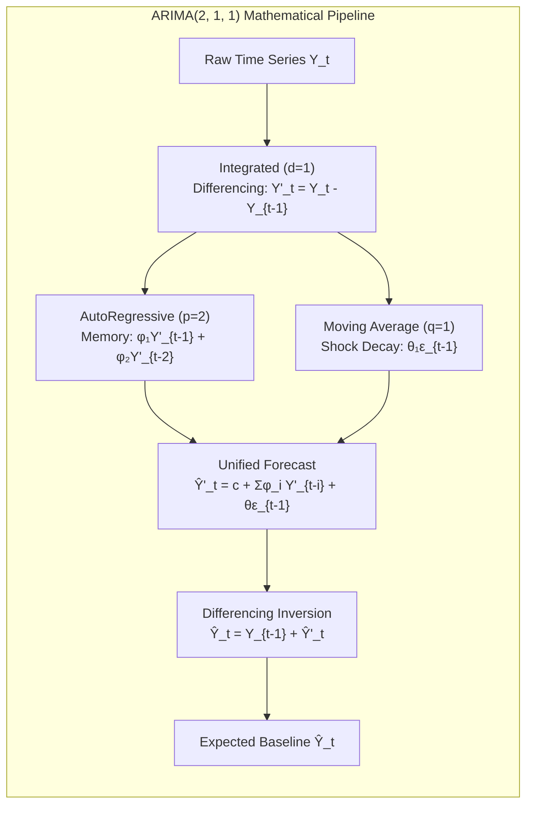
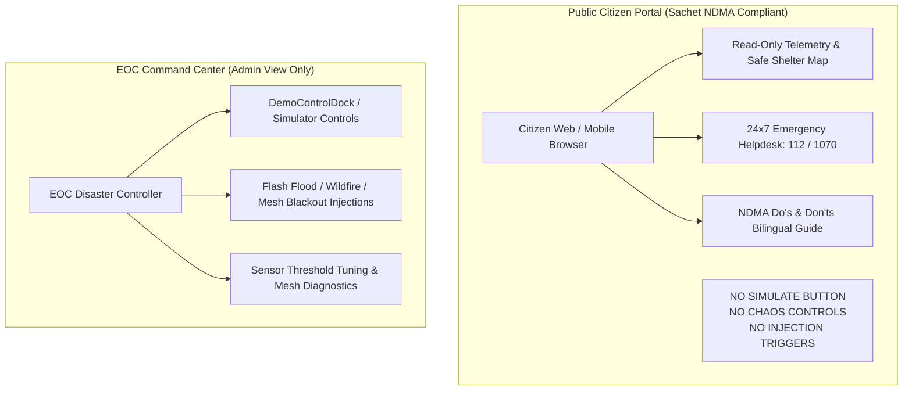

# Mathematical Foundations & Predictive Models

**System:** TERRA SHIELD Disaster Intelligence Engine  
**Module:** `backend/app/ai_engine.py` & `backend/app/routers/telemetry.py`  
**Problem Statement:** SIH26178 | **Theme:** Disaster Management  

---

## 1. The Forecasting Mathematics: ARIMA(p, d, q)

In real-world disaster management, physical environmental readings (e.g. river water level, ambient temperature, hazardous gas concentration) exhibit non-stationary behaviors due to seasonal daylight heating, tidal surges, and upstream dam discharges.

TERRA SHIELD employs an **ARIMA (AutoRegressive Integrated Moving Average)** mathematical foundation configured with $(p=2, d=1, q=1)$ to model hydrological trends and project future states up to 3 hours in advance.



---

### 1.1. AutoRegressive (AR - $p$)
The AutoRegressive component models the physical momentum of water or atmospheric accumulation. It posits that the current state depends directly on a linear combination of its $p$ prior states plus stochastic noise.

$$\boxed{Y_t = c + \sum_{i=1}^{p} \phi_i Y_{t-i} + \epsilon_t = c + \phi_1 Y_{t-1} + \phi_2 Y_{t-2} + \dots + \epsilon_t}$$

Where:
- $Y_t$: Current sensor stage at time $t$.
- $c$: Physical drift constant.
- $\phi_1, \phi_2$: AutoRegressive lag weights capturing hydraulic upstream momentum.
- $\epsilon_t \sim \mathcal{N}(0, \sigma^2)$: White noise residual shock at time $t$.

In hydrological terms, if water stage was rising rapidly at $t-2$ and $t-1$, momentum dictates water will continue rising into time $t$ unless countered by drainage capacity.

---

### 1.2. Integrated (I - $d$)
Raw hydrological data is non-stationary—a river during monsoon season displays a long-term upward trend that violates the constant-mean assumption of pure ARMA processes.

The Integrated step applies $d$-th order differencing to transform non-stationary raw time series into stationary zero-mean increments:

$$\boxed{Y'_t = (1 - B)^d Y_t}$$

For $d = 1$ (first-order differencing):
$$Y'_t = Y_t - Y_{t-1}$$

For $d = 2$ (second-order acceleration):
$$Y''_t = Y'_t - Y'_{t-1} = (Y_t - Y_{t-1}) - (Y_{t-1} - Y_{t-2}) = Y_t - 2Y_{t-1} + Y_{t-2}$$

TERRA SHIELD uses $d = 1$ to cancel diurnal environmental expansion and baseline ground elevation offsets.

---

### 1.3. Moving Average (MA - $q$)
Environmental sensors are subject to temporary perturbations—such as wind-blown waves splashing an ultrasonic sensor or sudden wind gusts diverting smoke away from a gas sensor.

The Moving Average component smooths out these temporary shocks by modeling the dependency between an observation and the residual error of past predictions:

$$\boxed{Y_t = c + \epsilon_t + \sum_{j=1}^{q} \theta_j \epsilon_{t-j} = c + \epsilon_t + \theta_1 \epsilon_{t-1} + \theta_2 \epsilon_{t-2} + \dots}$$

Where:
- $\theta_1$: Decay parameter for the previous prediction error $\epsilon_{t-1} = Y_{t-1} - \hat{Y}_{t-1}$.
- $|\theta_1| < 1$: Invertibility condition ensuring errors decay exponentially over time.

---

### 1.4. Unified ARIMA(2, 1, 1) Representation
Combining all three pillars using the Backshift Operator $B$ (where $B^k Y_t = Y_{t-k}$):

$$\boxed{\left(1 - \sum_{i=1}^{p} \phi_i B^i\right) (1 - B)^d Y_t = c + \left(1 + \sum_{j=1}^{q} \theta_j B^j\right) \epsilon_t}$$

Expanding for $(p=2, d=1, q=1)$:
$$(1 - \phi_1 B - \phi_2 B^2)(Y_t - Y_{t-1}) = c + (1 + \theta_1 B) \epsilon_t$$

Let $Y'_t = Y_t - Y_{t-1}$. Then:
$$Y'_t = c + \phi_1 Y'_{t-1} + \phi_2 Y'_{t-2} + \epsilon_t + \theta_1 \epsilon_{t-1}$$

Restoring absolute physical river stage $\hat{Y}_{t+1}$:
$$\hat{Y}_{t+1} = Y_t + \hat{Y}'_{t+1}$$

---

## 2. Decision Logic: Standardized Residual Anomaly Scoring

A sensor reading that is high (e.g. 3.5m) is not necessarily an anomaly if heavy rains were predicted. Conversely, an unexpected sudden surge of 0.5m during a dry morning is an acute disaster warning (e.g. upstream cloudburst or glacial outburst flood).

To decouple expected seasonal trends from acute hazards, TERRA SHIELD compares the real-time physical sensor reading against the mathematical ARIMA expected baseline:

```mermaid
graph TD
    OBS[Physical Sensor Stage Y_actual] --> RES[Residual Calculation<br>e_t = Y_actual - Ŷ_arima]
    ARIMA[ARIMA Expected Baseline Ŷ_arima] --> RES
    RES --> ZSCORE[Standardized Z-Score<br>Z_t = |e_t - μ_e| / σ_e]
    HIST_SIGMA[Sample Error Variance σ_e] --> ZSCORE

    ZSCORE --> DECISION{Z_t Threshold Evaluation}
    DECISION -->|Z_t < 2.0σ| NORM[SYSTEM OPTIMAL<br>Divergence within noise floor]
    DECISION -->|2.0σ <= Z_t < 3.0σ| CAUT[ELEVATED HYDROLOGICAL WATCH<br>Upstream runoff accumulating]
    DECISION -->|Z_t >= 3.0σ| CRIT[CRITICAL FLASH SURGE ANOMALY<br>Immediate Emergency Triggered]
```

---

### 2.1. Residual Error Formulation ($e_t$)
The residual error represents physical divergence from the ARIMA model:

$$\boxed{e_t = Y_{\text{actual}, t} - \hat{Y}_{\text{arima}, t}}$$

- $e_t \approx 0$: River stage perfectly tracks hydrodynamic projections.
- $e_t \gg 0$: Sudden unexpected surge (cloudburst, dam breach, levee collapse).
- $e_t \ll 0$: Sudden unexpected drop (upstream landslide blocking river course, forming a dam that may rupture).

---

### 2.2. Standardized Anomaly Z-Score ($Z_t$)
To make anomaly scoring scale-invariant across diverse river basins and mountain channels:

$$\boxed{Z_t = \frac{|e_t - \mu_e|}{\sigma_e}}$$

Where:
- $\mu_e = \frac{1}{N} \sum_{k=1}^N e_{t-k} \approx 0$: Expected mean error over rolling historical calibration window.
- $\sigma_e = \sqrt{\frac{1}{N-1} \sum_{k=1}^N (e_{t-k} - \mu_e)^2}$: Standard deviation of residual errors.
- $\sigma_{min} = 0.12\text{m}$: Physical sensor noise floor constant preventing division by zero during flat water conditions.

$$\sigma_e = \max(0.12, \text{std}(residuals))$$

---

### 2.3. Multi-Horizon Surge Projections & Momentum Boost
During an acute flash surge where $Z_t \ge 3.0$ or rate of change $\frac{\Delta h}{\Delta t} \ge 0.5\text{m} / 30\text{min}$, physical water momentum causes parabolic acceleration:

$$\boxed{S(h) = \hat{Y}_{\text{arima}}(h) + \frac{1}{2} a \cdot h^2}$$

Where:
- $h \in \{0.5, 1.0, 1.5, 2.0, 3.0\}$: Time horizon in hours.
- $a = 0.12 \times \left(\frac{\Delta h_{30m}}{0.5}\right)$: Hydraulic acceleration coefficient.

---

### 2.4. Hazard Decision Boundary Matrix

| Metric Value | Anomaly Z-Score | Physical River Stage | System Classification | Operational Action |
| :--- | :--- | :--- | :--- | :--- |
| $Z_t < 2.0\sigma$ | Low ($\le 1.99$) | $< 2.50\text{m}$ | **NORMAL / OPTIMAL** | Routine 60s telemetry broadcast; zero public alarm. |
| $2.0\sigma \le Z_t < 3.0\sigma$ | Moderate ($2.00 - 2.99$) | $2.50\text{m} - 3.99\text{m}$ | **ELEVATED WATCH** | Accelerate sensor sampling to 10s; notify Taluka disaster cell. |
| $Z_t \ge 3.0\sigma$ | Extreme ($\ge 3.00$) | $\ge 4.00\text{m}$ (Danger Mark) | **CRITICAL FLASH SURGE** | Broadcast Emergency Warning; trigger WhatsApp verification loop; activate local sirens. |

---

## 3. Wildfire & Atmospheric Spread Modeling

### 3.1. McArthur Forest Fire Danger Index (FFDI)
For edge nodes deployed in forest boundaries (e.g. Bandipur, Jim Corbett):

$$\boxed{FFDI = 2 \exp(-0.450 + 0.987 \ln(DF) - 0.0345 H + 0.0338 T + 0.0234 V)}$$

Where:
- $DF$: Drought Factor ($1 - 10$, derived from capacitive soil moisture and rain interval).
- $H$: Ambient relative humidity percentage (DHT22).
- $T$: Ambient temperature in Celsius (DHT22).
- $V$: Wind velocity in km/h (Anemometer).

---

## 4. Why Citizen Portal Has No Simulate Option

> **CRITICAL DISASTER GOVERNANCE PRINCIPLE:**  
> *Simulation and chaos testing tools belong exclusively in the Emergency Operations Center (EOC) Command View, never on a public citizen-facing portal.*



### 4.1. Prevention of Public Panic & Mass Evacuation Chaos
If a citizen or malicious actor clicks *"Simulate Flash Flood"* on a public dashboard:
1. **Unwarranted Panic:** Screenshots of red flood alerts spread instantly across WhatsApp groups.
2. **Resource Exhaustion:** Thousands of panicked citizens flood district emergency helplines (112 / 1070), paralyzing first responders.
3. **Stampede & Traffic Gridlock:** False evacuations cause bridge blockages and civilian casualties.

### 4.2. Role-Based Access Control (RBAC) Architecture
- **Citizen Portal (`currentView === 'USER'`):**
  - **Information Consumer Only.**
  - Focuses on verified situational awareness: active flood levels, safe evacuation shelter occupancies, live emergency contact numbers, and multilingual safety instructions.
  - Hides all `Simulate Scenario`, `LoRa Mesh Failover`, and `Reset Network` buttons.
- **EOC Command Center (`currentView === 'ADMIN'`):**
  - **Operations Controller.**
  - Full access to `SimulationControls.jsx` and `DemoControlDock.tsx` for drill training, operator onboarding, and hardware-in-the-loop stress testing.
