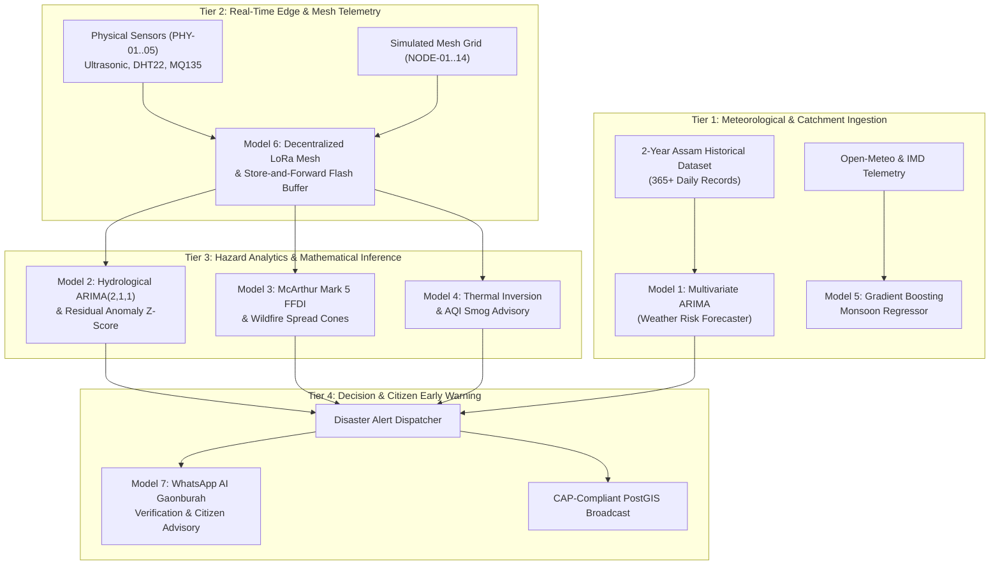
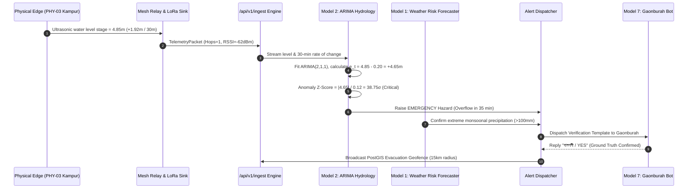

# TERRA SHIELD - AI & Mathematical Models Architecture

**Problem Statement:** SIH26178 | **Theme:** Disaster Management  
**System:** TERRA SHIELD Multi-Hazard Early Warning & Resilient Mesh Network  
**Operational Target:** Brahmaputra & Kopili River Basin, Assam (16 June Incident Baseline)

---

## Executive Overview

TERRA SHIELD employs a **multi-tiered, hybrid edge-cloud mathematical and machine learning model architecture**. Unlike monolithic black-box systems, TERRA SHIELD decouples real-time physical sensor physics, statistical time-series forecasting, empirical fire/smog dynamics, and decentralized ad-hoc mesh consensus into specialized, explainable modules.

---

## Complete Model Directory

Each model is documented in a dedicated specification file:

| Model # | Model Name | Primary Code Implementation | Documentation Link | Key Metrics / Formulae |
| :--- | :--- | :--- | :--- | :--- |
| **Model 1** | **Multivariate ARIMA Weather Risk Forecaster** | [`backend/model1/`](file:///c:/Users/ASUS/sih/backend/model1/) & [`backend/app/risk_forecaster/`](file:///c:/Users/ASUS/sih/backend/app/risk_forecaster/) | [`MODEL_01_ARIMA_WEATHER_RISK_FORECASTER.md`](file:///c:/Users/ASUS/sih/docs/MODEL_01_ARIMA_WEATHER_RISK_FORECASTER.md) | AIC Grid Search, Multi-hazard risk score ($0.0 - 1.0$), 7-day horizon |
| **Model 2** | **Hydrological ARIMA(2,1,1) & Residual Z-Score** | [`backend/app/ai_engine.py`](file:///c:/Users/ASUS/sih/backend/app/ai_engine.py#L8-L221) | [`MODEL_02_HYDROLOGICAL_SURGE_ARIMA_ZSCORE.md`](file:///c:/Users/ASUS/sih/docs/MODEL_02_HYDROLOGICAL_SURGE_ARIMA_ZSCORE.md) | $\text{ARIMA}(2,1,1)$, $Z_t = \frac{\|e_t - \mu_e\|}{\sigma_e}$, $HFL = 4.75\text{m}$ breach |
| **Model 3** | **McArthur FFDI & Directional Fire Spread** | [`backend/app/ai_engine.py`](file:///c:/Users/ASUS/sih/backend/app/ai_engine.py#L223-L291) | [`MODEL_03_WILDFIRE_MCARTHUR_FFDI_SPREAD.md`](file:///c:/Users/ASUS/sih/docs/MODEL_03_WILDFIRE_MCARTHUR_FFDI_SPREAD.md) | $\text{FFDI} \le 120$, Forward speed $R = 0.0012 \cdot \text{FFDI} \cdot V$, $35^\circ$ cone |
| **Model 4** | **Thermal Inversion & AQI Particulate Dispersion** | [`backend/app/ai_engine.py`](file:///c:/Users/ASUS/sih/backend/app/ai_engine.py#L293-L316) | [`MODEL_04_AQI_SMOG_THERMAL_INVERSION.md`](file:///c:/Users/ASUS/sih/docs/MODEL_04_AQI_SMOG_THERMAL_INVERSION.md) | PM2.5/PM10 inversion index, 3-hour acute exposure window |
| **Model 5** | **Gradient Boosting Monsoonal Regressor** | [`backend/scripts/train_weather_model.py`](file:///c:/Users/ASUS/sih/backend/scripts/train_weather_model.py) | [`MODEL_05_GRADIENT_BOOSTING_WEATHER.md`](file:///c:/Users/ASUS/sih/docs/MODEL_05_GRADIENT_BOOSTING_WEATHER.md) | GradientBoostingRegressor, 72-hour hourly forecast projection |
| **Model 6** | **Decentralized LoRa Mesh & Store-and-Forward** | [`backend/app/mesh_manager.py`](file:///c:/Users/ASUS/sih/backend/app/mesh_manager.py) & [`firmware`](file:///c:/Users/ASUS/sih/hardware/esp32_firmware/esp32_firmware.ino) | [`MODEL_06_MESH_NETWORK_AND_STORE_FORWARD_SIMULATOR.md`](file:///c:/Users/ASUS/sih/docs/MODEL_06_MESH_NETWORK_AND_STORE_FORWARD_SIMULATOR.md) | LittleFS ring buffer (200 records), dynamic parent rerouting, blackout failover |
| **Model 7** | **WhatsApp Consensus & Citizen Advisory Engine** | [`backend/app/whatsapp_bot.py`](file:///c:/Users/ASUS/sih/backend/app/whatsapp_bot.py) & [`v1/alerts.py`](file:///c:/Users/ASUS/sih/backend/app/routers/v1/alerts.py) | [`MODEL_07_CITIZEN_ALERT_AND_SARPANCH_GROUND_TRUTH.md`](file:///c:/Users/ASUS/sih/docs/MODEL_07_CITIZEN_ALERT_AND_SARPANCH_GROUND_TRUTH.md) | Bi-directional NLP sentiment (Assamese/Hindi/English), PostGIS ST_DWithin radius |

---

## Cross-Model Data Flow & Coordination Matrix

---

## Hardware-Software Convergence Principles

1. **Deterministic Latency**: On-device threshold evaluation executes within $<5\text{ms}$ on the ESP32 microsecond clock before radio transmission.
2. **Bandwidth Efficiency**: Raw time-series points are reduced to structured packed structs (48 bytes per packet) over LoRa / ESP-NOW.
3. **Resilience to Infrastructure Failure**: If towers fail, the network automatically switches to decentralized mesh routing with zero packet loss via LittleFS store-and-forward buffers.
4. **Transparent Explainability**: Every alert generated displays the exact mathematical order, residual deviation, and physical threshold that triggered it.
