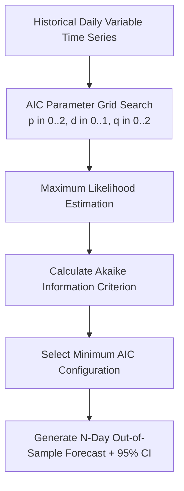

# Model 1: Multivariate ARIMA Weather Risk Forecaster

**Module Location:** [`backend/model1/`](file:///c:/Users/ASUS/sih/backend/model1/) and [`backend/app/risk_forecaster/`](file:///c:/Users/ASUS/sih/backend/app/risk_forecaster/)  
**Service Endpoint:** `GET /api/v1/weather/multi-hazard-risk`  
**Problem Statement:** SIH26178 | **Theme:** Disaster Management  
**Geographic Calibration:** Brahmaputra & Kopili River Basin, Assam (16 June Deluge Event)

---

## 1. Executive Summary & Purpose

Traditional weather forecasts provide raw numerical measurements (e.g. "rainfall: 82mm") without translating those numbers into actionable disaster probabilities. **Model 1** implements a **multivariate statistical forecasting engine** that models each meteorological variable independently using auto-calibrated ARIMA time-series models, then feeds multi-day forecasts through an explainable multi-hazard rule engine to quantify:
1. **Flood Inundation Risk** ($0.0 - 1.0$)
2. **Agricultural & Hydrological Drought Risk** ($0.0 - 1.0$)
3. **Forest Fire-Weather Danger Index** ($0.0 - 1.0$)
4. **Composite Catchment Severity** (`NORMAL`, `ELEVATED`, `CRITICAL`)

---

## 2. Target Meteorological Variables

Model 1 processes 6 core atmospheric variables recorded at daily intervals:

| Variable | Unit | Physical Role in Multi-Hazard Modeling |
| :--- | :--- | :--- |
| **`precipitation`** | $\text{mm}$ | Primary driver of flash floods, river overtopping, and drought negation |
| **`temp_max`** | $^\circ\text{C}$ | Peak daytime heat, driving evapotranspiration and wildfire ignition risk |
| **`temp_min`** | $^\circ\text{C}$ | Nighttime baseline, indicator of diurnal thermal swings and frost/heatwaves |
| **`humidity`** | $\%$ | Relative humidity; critical damping factor for fire and multiplier for flood saturation |
| **`wind_speed`** | $\text{m/s}$ | Air velocity accelerating wildfire propagation and storm surge fronts |
| **`pressure`** | $\text{hPa}$ | Atmospheric pressure indicator of monsoonal depressions and tropical low-pressure cells |

---

## 3. Mathematical Foundations: Auto-Calibrated ARIMA(p, d, q)

Each variable $X_v$ is modeled as a univariate stochastic process via **ARIMA (AutoRegressive Integrated Moving Average)**:

$$\left(1 - \sum_{i=1}^{p} \phi_i B^i\right) (1 - B)^d X_{v,t} = c + \left(1 + \sum_{j=1}^{q} \theta_j B^j\right) \epsilon_t$$

Where:
- $B$ is the backshift operator ($B^k X_t = X_{t-k}$).
- $d \in \{0, 1\}$ is determined by stationarity tests (first-order differencing applied to non-stationary variables).
- $p \in \{0, 1, 2\}$ auto-regressive memory order.
- $q \in \{0, 1, 2\}$ moving average shock decay order.
- $\epsilon_t \sim \mathcal{N}(0, \sigma^2)$ white noise error.

### 3.1. Order Selection via Akaike Information Criterion (AIC)
To prevent overfitting while preserving physical dynamic memory, Model 1 performs an automated grid search across candidate orders $(p, d, q) \in [0, 2] \times [0, 1] \times [0, 2]$:

$$\text{AIC} = 2k - 2\ln(\hat{L})$$

Where:
- $k = p + q + 1$ is the number of estimated parameters.
- $\hat{L}$ is the maximized value of the likelihood function for the fitted model.

The candidate configuration with the minimum AIC score is chosen for each respective variable.



---

## 4. Multi-Hazard Risk Assessment Rules

The forecasted meteorological trajectories $\hat{X}_{v, t+1}, \dots, \hat{X}_{v, t+H}$ over horizon $H = 7$ days are evaluated against calibrated threshold criteria in [`config.py`](file:///c:/Users/ASUS/sih/backend/model1/config.py):

### 4.1. Flood Risk Rule Engine
- **Cumulative Rainfall Criterion**: Total rainfall over $H$ days:
  $$P_{cum} = \sum_{h=1}^{H} \hat{P}_h \ge 100.0\text{ mm}$$
- **Single-Day Surge Criterion**: Any single day experiencing extreme downpour:
  $$\max_{h} \hat{P}_h \ge 50.0\text{ mm}$$
- **Catchment Saturation Factor**: Average relative humidity $\bar{H}_{pct} \ge 80.0\%$.
- **Score Formulation**:
  $$S_{flood} = \min\left(1.0, \; 0.5 \cdot \frac{P_{cum}}{100.0} + 0.3 \cdot \frac{\max_h \hat{P}_h}{50.0} + 0.2 \cdot \frac{\bar{H}_{pct}}{80.0}\right)$$

### 4.2. Drought Risk Rule Engine
- Triggered when precipitation is suppressed over extended horizons under high thermal loads:
  $$P_{cum} \le 2.0\text{ mm}, \quad \bar{T}_{mean} \ge 30.0^\circ\text{C}, \quad \bar{H}_{pct} \le 35.0\%$$
- **Score Formulation**:
  $$S_{drought} = \min\left(1.0, \; \frac{30.0 - P_{cum}}{30.0} \times \frac{\bar{T}_{mean}}{35.0}\right)$$

### 4.3. Wildfire Risk Rule Engine
- Combines thermal desiccation, dry forest foliage, and wind velocity:
  $$\bar{T}_{mean} \ge 32.0^\circ\text{C}, \quad \bar{H}_{pct} \le 30.0\%, \quad \bar{V}_{wind} \ge 4.0\text{ m/s}, \quad P_{cum} \le 1.0\text{ mm}$$
- **Score Formulation**:
  $$S_{fire} = \min\left(1.0, \; 0.35 \cdot \frac{\bar{T}_{mean}}{35.0} + 0.35 \cdot \frac{30.0}{\max(5.0, \bar{H}_{pct})} + 0.30 \cdot \frac{\bar{V}_{wind}}{6.0}\right)$$

---

## 5. Dataset & Data Pipeline

Model 1 supports three ingestion backends:
1. **Primary Historical Ingestion**: [`backend/data/assam_weather_2years.csv`](file:///c:/Users/ASUS/sih/backend/data/assam_weather_2years.csv) containing 365+ daily records specifically calibrated to the Brahmaputra & Kopili river basin ($26.1850^\circ\text{ N}, 91.7500^\circ\text{ E}$).
2. **Live OpenWeather API (One Call 3.0)**: Used when an external API key is provided (`--source api`).
3. **Synthetic Catchment Fallback**: Generates realistic monsoonal sinusoidal waves with Gaussian noise for offline sandbox demonstrations (`--source synthetic`).

---

## 6. API Specification & Integration

### Endpoint: `GET /api/v1/weather/multi-hazard-risk`
- **Query Parameters**:
  - `horizon_days` (int, default: `7`, range: `1..14`)
  - `lat` (float, default: `26.1850`)
  - `lng` (float, default: `91.7500`)
  - `source` (string, default: `"auto"`)

### Response JSON Schema
```json
{
  "region": "Brahmaputra & Kopili Basin, Assam (16 June Incident)",
  "coordinates": {
    "latitude": 26.185,
    "longitude": 91.75
  },
  "horizon_days": 7,
  "overall_severity": "CRITICAL",
  "max_risk_score": 0.84,
  "triggered_hazards": ["flood"],
  "dates": [
    "2026-09-29",
    "2026-09-30",
    "2026-10-01",
    "2026-10-02",
    "2026-10-03",
    "2026-10-04",
    "2026-10-05"
  ],
  "daily_projections": [
    {
      "date": "2026-09-29",
      "temp_max": 28.5,
      "temp_min": 21.2,
      "humidity": 88.0,
      "precipitation": 64.2,
      "pressure": 1008.2,
      "wind_speed": 4.8
    }
  ],
  "risks": {
    "flood": {
      "score": 0.84,
      "triggered": true,
      "reasons": [
        "Forecasted cumulative precipitation (142.6 mm) exceeds danger threshold (100.0 mm).",
        "Single-day surge of 64.2 mm on 2026-09-29 exceeds flash threshold (50.0 mm)."
      ]
    },
    "drought": {
      "score": 0.0,
      "triggered": false,
      "reasons": []
    },
    "fire": {
      "score": 0.0,
      "triggered": false,
      "reasons": []
    }
  },
  "model_metadata": {
    "variables_modeled": ["temp_max", "temp_min", "humidity", "precipitation", "pressure", "wind_speed"],
    "orders": {
      "precipitation": [2, 1, 3],
      "temp_max": [1, 1, 3],
      "humidity": [0, 1, 1]
    }
  }
}
```

---

## 7. Standalone CLI Verification

You can execute Model 1 directly from the command line:

```bash
# Execute using synthetic test series
python backend/model1/main.py --source synthetic --horizon 7

# Execute using historical Assam dataset
python backend/model1/main.py --source csv --csv-path backend/data/assam_weather_2years.csv --horizon 7
```
