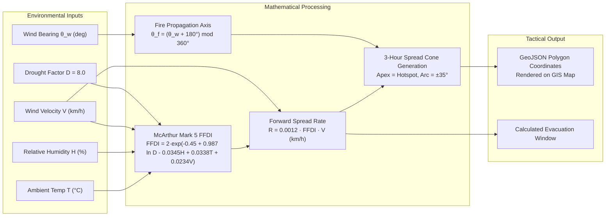

# Model 3: McArthur Forest Fire Danger Index & Directional Spread Vector

**Module Location:** [`backend/app/ai_engine.py`](file:///c:/Users/ASUS/sih/backend/app/ai_engine.py#L223-L291)  
**Service Endpoint:** `POST /api/simulation/trigger` (`scenario="WILDFIRE"`) & `MapView.jsx` / `MapView.tsx`  
**Problem Statement:** SIH26178 | **Theme:** Disaster Management  
**Geographic Calibration:** North Guwahati Hill Slopes & Karbi Anglong Foothill Forest Fringe (`NODE-07`, `NODE-08`)

---

## 1. Executive Summary & Purpose

Forest fires and foothill slope wildfires present rapid, non-linear threats due to the compounding interaction between ambient temperature, dry foliage moisture content, and surface wind vectors. 

**Model 3** implements the **McArthur Mark 5 Forest Fire Danger Index (FFDI)** empirical mathematical formulation coupled with a **Trigonometric Directional Propagation Cone Engine**. Rather than simply flagging a point coordinate, Model 3 calculates the forward rate of spread ($R$ in km/h), determines the downwind propagation axis, and constructs a dynamic 3-hour risk polygon rendered directly on the GIS command map.



---

## 2. Mathematical Formulation

### 2.1. McArthur Mark 5 FFDI Empirical Equation
The McArthur Forest Fire Danger Index represents the difficulty of fire suppression on a continuous scale up to $120.0$:

$$\boxed{\text{FFDI} = 2.0 \cdot \exp\left(-0.450 + 0.987 \ln(D) - 0.0345 H + 0.0338 T + 0.0234 V\right)}$$

Where:
- $D = 8.0$: Foliage drought factor index calibrated for dense sub-tropical deciduous foliage during dry spells.
- $H \in [5.0, 100.0]$: Relative ambient humidity percentage.
- $T \ge 10.0$: Ambient dry-bulb temperature in $^\circ\text{C}$.
- $V \ge 1.0$: Surface wind velocity in $\text{km/h}$.

### Risk Category Classification:
| FFDI Value | Danger Classification | Propagation Characteristics | Suppression Difficulty |
| :--- | :--- | :--- | :--- |
| **$\text{FFDI} \ge 50$** | **Extreme / Emergency** | Crown fire possible, rapid spot-fire ignition ahead of front | Direct attack impossible; evacuate perimeter |
| **$25 \le \text{FFDI} < 50$** | **Very High** | High intensity ground fire, aggressive flame height | Heavy machinery & aerial fire-breaks required |
| **$12 \le \text{FFDI} < 25$** | **High** | Moderate head fire, controlled spread | Hand tools and ground crews effective |
| **$\text{FFDI} < 12$** | **Moderate / Low** | Slow creeping fire in leaf litter | Readily extinguished |

---

### 2.2. Rate of Forward Spread ($R$)
The rate of head-fire propagation in kilometers per hour ($R$) is determined by the empirical relationship between the fuel dryness index and convective wind driving:

$$\boxed{R = 0.0012 \times \text{FFDI} \times V \quad (\text{km/h})}$$

### 2.3. Directional Axis & 3-Hour Reach Distance
Wind direction $\theta_{wind}$ is measured as the direction wind blows *from*. Consequently, fire propagates downwind towards bearing $\theta_{fire}$:
$$\theta_{fire} = (\theta_{wind} + 180.0^\circ) \bmod 360.0^\circ$$

The operational suppression reach distance over a 3-hour response window is bounded by:
$$L_{reach} = \min\left(12.0\text{ km}, \; R \times 2.5\right)$$

---

### 2.4. Spherical Cone Polygon Construction
To project the physical hazard cone on a GIS map, Model 3 computes coordinate offsets from the origin hotspot $(\phi_0, \lambda_0)$ across an angular half-spread of $\alpha = 35.0^\circ$ ($70^\circ$ total arc):

$$\Delta \phi = \frac{L_{reach} \cdot \cos(\alpha_i)}{111.0\text{ km/deg}}$$
$$\Delta \lambda = \frac{L_{reach} \cdot \sin(\alpha_i)}{111.0 \cdot \cos(\phi_0)\text{ km/deg}}$$

Where:
- $\alpha_i \in [\theta_{fire} - 35^\circ, \; \theta_{fire} + 35^\circ]$ sampled at 7 distinct radial azimuths.
- The apex of the polygon is anchored at $[\phi_0, \lambda_0]$ and closed at the final vertex.

---

## 3. Simulation Benchmark & Response

In the hackathon demonstration sandbox, triggering `scenario="WILDFIRE"` injects:
- **Location**: Karbi Anglong Foothills / North Guwahati (`NODE-07` or `NODE-08`)
- **Temperature**: $44.2^\circ\text{C}$
- **Humidity**: $11.5\%$
- **Wind Speed**: $31.0\text{ km/h}$
- **Wind Direction**: $225^\circ$ (South-West) $\rightarrow$ Fire propagates towards $45^\circ$ (North-East)
- **Calculated FFDI**: **$68.4$ (Extreme)**
- **Propagation Speed**: **$2.54\text{ km/h}$**
- **Calculated Reach**: **$6.35\text{ km}$** cone enclosing inhabited forest settlements.

### Response JSON Schema:
```json
{
  "status": "triggered",
  "scenario": "WILDFIRE",
  "node_id": "NODE-07",
  "alert_id": 6,
  "model_type": "McArthur Mark 5 FFDI",
  "fire_danger_index": 68.4,
  "propagation_speed_kmh": 2.54,
  "bearing_degrees": 45.0,
  "message": "Wildfire outbreak injected at Karbi Foothill Watch. Directional spread vector calculated!"
}
```

---

## 4. Frontend Map Rendering Integration

In [`frontend/src/components/MapView.jsx`](file:///c:/Users/ASUS/sih/frontend/src/components/MapView.jsx#L85-L105), the resulting `fireVectors` array is ingested and rendered via Leaflet's `L.polygon`:
```javascript
const polygon = L.polygon(vector.cone_polygon_coords, {
  color: '#ea580c',
  fillColor: '#ea580c',
  fillOpacity: 0.28,
  weight: 2,
  dashArray: '4, 6'
});
```
