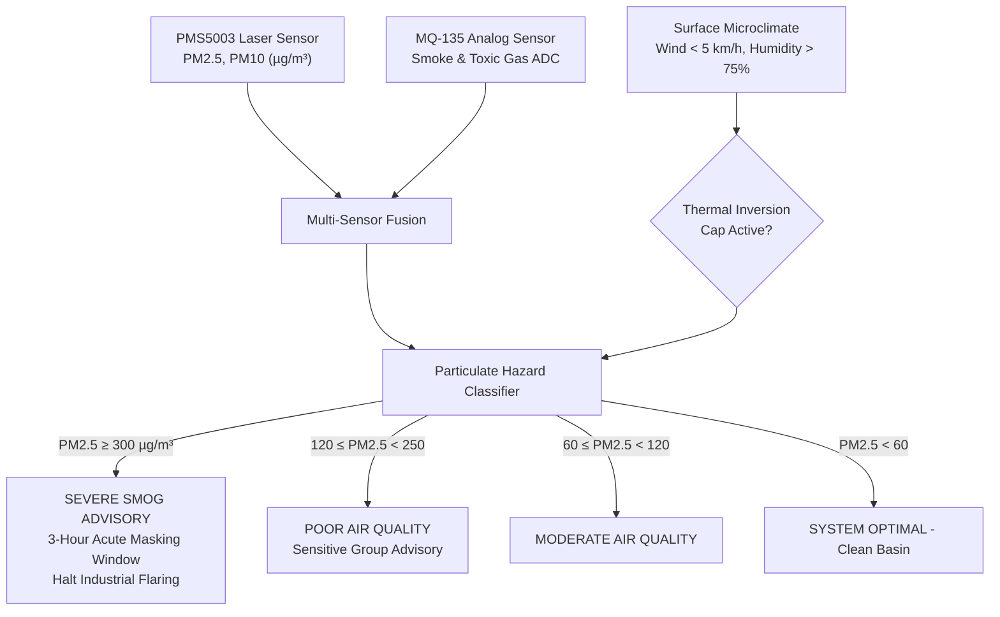

# Model 4: Thermal Inversion & AQI Particulate Dispersion Model

**Module Location:** [`backend/app/ai_engine.py`](file:///c:/Users/ASUS/sih/backend/app/ai_engine.py#L293-L316)  
**Service Endpoint:** `POST /api/simulation/trigger` (`scenario="POLLUTION_SPIKE"`) & `/api/v1/ingest/reading`  
**Problem Statement:** SIH26178 | **Theme:** Disaster Management  
**Geographic Calibration:** Noonmati Refinery Industrial Corridor, Guwahati, Assam (`NODE-13`)

---

## 1. Executive Summary & Purpose

Industrial valleys and riverine catchments frequently suffer from **nocturnal and winter thermal inversions**—a meteorological phenomenon where a layer of warm air traps cooler surface air beneath it like a lid. In river basins surrounded by hills (such as the Guwahati and Brahmaputra valley), thermal inversions prevent vertical convection, causing industrial particulate matter ($\text{PM}_{2.5}$ and $\text{PM}_{10}$) to accumulate to hazardous levels within hours.

**Model 4** evaluates particulate concentration telemetry from multi-sensor nodes (MQ-135 + laser scattering), detects thermal inversion trapping conditions, and calculates the **Acute Health Advisory Window** for vulnerable populations and regulatory authorities.



---

## 2. Sensor Fusion & Particulate Physics

Edge nodes deployed in industrial corridors capture:
1. **$\text{PM}_{2.5}$ (Fine Respirable Particulates)**: Diameter $< 2.5\,\mu\text{m}$, penetrating deep into human lung alveoli.
2. **$\text{PM}_{10}$ (Inhalable Coarse Particulates)**: Diameter $< 10\,\mu\text{m}$, originating from dust and industrial crushing.
3. **MQ-135 Reducing Gas Resistance**: Detects associated combustion gases ($\text{NH}_3$, $\text{NO}_x$, alcohol, benzene, smoke).

### Conversion from Sensor ADC to Calibrated Micrograms:
On the edge ESP32 microcontroller, the raw 12-bit ADC reading ($0 - 4095$) is transformed to an estimated $\text{PM}_{2.5}$ concentration via piecewise linear mapping:
$$\text{PM}_{2.5} = \text{clamp}\left(10.0, \; 500.0, \; 25.0 + \frac{\text{ADC} - 200}{4095 - 200} \times (450.0 - 25.0)\right)$$

---

## 3. Atmospheric Inversion Trapping Criteria

The mathematical decision logic evaluates whether particulate accumulation is transient or trapped in a stagnant thermal inversion layer:

$$\text{Inversion Flag} = \mathbb{I}\left(V_{wind} \le 5.0\text{ km/h} \quad \wedge \quad H_{pct} \ge 75.0\% \quad \wedge \quad \Delta T_{diurnal} \le 4.0^\circ\text{C}\right)$$

When the inversion flag is active:
- Particulate dispersion coefficient $K_{disp} \approx 0$.
- Concentration is modeled to decay exponentially only after solar surface heating breaks the inversion layer (estimated minimum duration: **3.0 hours**).

### Air Quality Decision Matrix:
| $\text{PM}_{2.5}$ Threshold ($\mu\text{g/m}^3$) | Air Quality Category | Color Code | Automated Public Safety Advisory |
| :--- | :--- | :--- | :--- |
| **$\ge 300.0$** | **`SEVERE`** | `PURPLE (#7c3aed)` | Emergency alert: Mandatory N95 masks, halt open construction, suspend schools. |
| **$120.0 - 299.9$** | **`POOR`** | `RED (#dc2626)` | High risk: Sensitive individuals, elderly, and cardiac patients remain indoors. |
| **$60.0 - 119.9$** | **`MODERATE`** | `AMBER (#d97706)` | Moderate risk: Slight respiratory discomfort possible for vulnerable groups. |
| **$< 60.0$** | **`NORMAL`** | `GREEN (#16a34a)` | Satisfactory: Air quality poses minimal or no health threat. |

---

## 4. Simulation Benchmark & Response

In the hackathon demonstration sandbox, triggering `scenario="POLLUTION_SPIKE"` injects:
- **Target Node**: `NODE-13` (Noonmati Refinery AQI Sensor)
- **$\text{PM}_{2.5}$**: $348.0\,\mu\text{g/m}^3$ (Severe spike)
- **$\text{PM}_{10}$**: $495.0\,\mu\text{g/m}^3$
- **Wind Speed**: $4.0\text{ km/h}$ (Stagnant boundary layer)
- **Relative Humidity**: $78.0\%$ (Dense particulate haze)
- **Calculated Severity**: **`SEVERE`**
- **Advisory Window**: **3.0 hours** mandatory mask notice

### Response JSON Schema:
```json
{
  "status": "triggered",
  "scenario": "POLLUTION_SPIKE",
  "node_id": "NODE-13",
  "alert_id": 7,
  "model_type": "Thermal Inversion AQI Window",
  "severity": "SEVERE",
  "advisory_window_hours": 3.0,
  "message": "AQI smog spike injected at Noonmati Refinery AQI Sensor."
}
```
