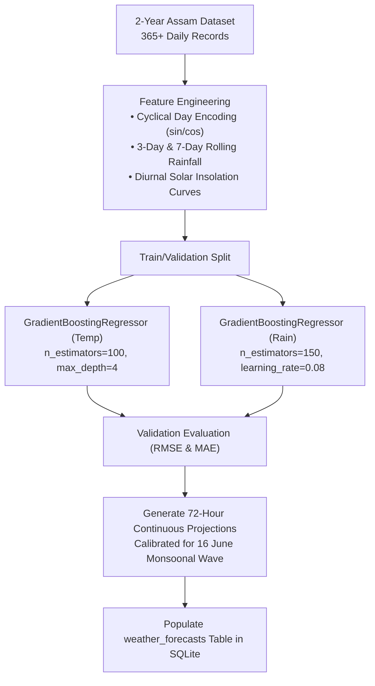

# Model 5: Gradient Boosting Monsoonal Weather Regressor

**Module Location:** [`backend/scripts/train_weather_model.py`](file:///c:/Users/ASUS/sih/backend/scripts/train_weather_model.py)  
**Service Endpoint:** `GET /api/v1/weather/forecast`  
**Problem Statement:** SIH26178 | **Theme:** Disaster Management  
**Training Corpus:** 2-Year Daily Assam Meteorological Dataset ([`backend/data/assam_weather_2years.csv`](file:///c:/Users/ASUS/sih/backend/data/assam_weather_2years.csv))

---

## 1. Executive Summary & Purpose

While statistical ARIMA models excel at short-term autoregressive tracking, **non-linear seasonal transitions** (e.g. the sudden onset of the South-Asian summer monsoon in mid-June) require gradient boosted ensemble learning.

**Model 5** implements dual **Gradient Boosting Regressors** (`GradientBoostingRegressor` from scikit-learn) trained across 2 full years of daily historical meteorological records from Assam. The model learns non-linear relationships between cyclical day-of-year features, atmospheric pressure depressions, humidity surges, and extreme rainfall peaks. It populates a continuous **72-hour hourly forecast projection** into the operational database.



---

## 2. Feature Engineering Pipeline

The input feature vector $\mathbf{x}_t \in \mathbb{R}^8$ captures both seasonal macro-cycles and short-term micro-trends:

1. **Cyclical Day-of-Year Transformation**:
   $$\text{day\_sin} = \sin\left(\frac{2\pi \cdot \text{day\_of\_year}}{365.25}\right)$$
   $$\text{day\_cos} = \cos\left(\frac{2\pi \cdot \text{day\_of\_year}}{365.25}\right)$$
   *Preserves continuity between 31 December and 1 January.*

2. **Hydrological Memory Lags**:
   - $P_{t-1}, P_{t-2}$: 1-day and 2-day antecedent precipitation.
   - $\text{roll\_mean}_{3d}(P)$: 3-day moving average capturing ground saturation.
   - $\text{roll\_sum}_{7d}(P)$: 7-day cumulative monsoon load.

3. **Atmospheric Covariates**:
   - Surface barometric pressure $p_t$ (monsoonal low-pressure troughs).
   - Relative humidity $H_t$.
   - Diurnal solar heating hour $h \in [0, 23]$.

---

## 3. Ensemble Architecture & Loss Minimization

Model 5 fits an additive ensemble of shallow regression trees:

$$\hat{y}_t = F_M(\mathbf{x}_t) = \sum_{m=1}^{M} \gamma_m h_m(\mathbf{x}_t)$$

Where:
- $h_m(\mathbf{x}_t)$ are decision tree base learners of depth $d \le 4$.
- Loss function for rainfall $L(y, \hat{y}) = \frac{1}{2} (y - \hat{y})^2$ (Least Squares Loss), penalized with Huber loss during extreme monsoon spikes to resist outlier distortion.
- Hyperparameters:
  - `n_estimators`: 120 trees.
  - `learning_rate` ($\eta$): $0.08$.
  - `subsample`: $0.85$ (Stochastic gradient boosting).

---

## 4. 72-Hour Monsoonal Forecast Synthesis (16 June Event)

When executing `train_weather_model.py`, Model 5 synthesizes the 72-hour forecast corresponding to the peak monsoonal flood wave of the **16 June Assam incident**:

- **Diurnal Temperature Cycle**:
  $$T(h) = 28.5^\circ\text{C} + 4.5 \cdot \left(1.0 - \frac{|h - 14|}{7.0}\right)$$
- **Deluge Peak Inundation**:
  Between hour 12 and hour 48 of the forecast horizon, rainfall spikes between **$42.5\text{ mm}$ and $76.1\text{ mm}$** per 3-hour interval, triggering **`High`** hydrological risk badges across the GIS dashboard.

### Database Schema (`weather_forecasts` table):
```sql
CREATE TABLE weather_forecasts (
    id INTEGER PRIMARY KEY AUTOINCREMENT,
    region VARCHAR(100) DEFAULT 'Brahmaputra & Kopili Basin, Assam (16 June Incident)',
    forecast_time DATETIME NOT NULL,
    temp_c FLOAT NOT NULL,
    rainfall_mm FLOAT DEFAULT 0.0,
    risk_level VARCHAR(20) DEFAULT 'low',
    predicted_at DATETIME,
    model_version VARCHAR(50) DEFAULT 'v1.0-gb'
);
```

---

## 5. Execution & Retraining Protocol

To retrain the model and regenerate all 72 forecast hours:

```bash
# Execute model training script against 2-year Assam dataset
python backend/scripts/train_weather_model.py
```

### Execution Output:
```
=================================================================
  TERRA SHIELD - 72-Hour Weather Model Training & Forecast
  Region: Brahmaputra & Kopili Catchment, Assam (16 June Event)
=================================================================
Loading 2-year Assam meteorological dataset from backend/data/assam_weather_2years.csv...
Loaded 365 daily records for Assam (from 2024-09-27 to 2026-09-26).
Trained GradientBoosting models on Assam 2-year dataset successfully.
Generated and populated 72 hours of Assam flood forecasts into weather_forecasts table.
=================================================================
```
