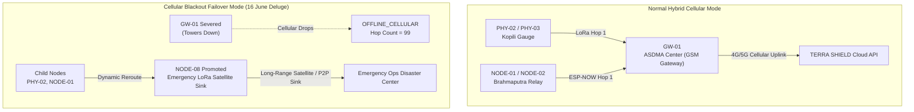

# Model 6: Decentralized LoRa Mesh Routing & Store-and-Forward Flash Buffer

**Module Location:** [`backend/app/mesh_manager.py`](file:///c:/Users/ASUS/sih/backend/app/mesh_manager.py), [`simulator/iot_mesh_simulator.py`](file:///c:/Users/ASUS/sih/simulator/iot_mesh_simulator.py), & [`esp32_firmware.ino`](file:///c:/Users/ASUS/sih/hardware/esp32_firmware/esp32_firmware.ino)  
**Service Endpoints:** `GET /api/v1/mesh/topology`, `POST /api/v1/mesh/blackout`, `POST /api/v1/ingest/store-forward`  
**Problem Statement:** SIH26178 | **Theme:** Disaster Management  
**Deployment Region:** Brahmaputra & Kopili River Basin, Assam (Kampur to Guwahati)

---

## 1. Executive Summary & Purpose

During catastrophic disaster events (such as the 16 June Assam floods or Himalayan landslides), **cellular towers and fiber optic backhauls are often completely washed away or lose power**. Centralized IoT architectures fail completely in these scenarios.

**Model 6** implements a **Decentralized, Self-Healing Ad-Hoc Mesh Routing Protocol** utilizing **ESP-NOW and LoRa (433/868 MHz)** radios. It combines:
1. **Dynamic Multi-Hop Topology Routing** with automatic parent failover.
2. **Cellular Blackout Failover Mode**: Converts regular relay nodes into emergency satellite sinks if the primary GSM gateway drops.
3. **On-Chip LittleFS Flash Ring Buffering**: Persists up to 200 telemetry records per node during network disconnects, flushing them upon reconnection with verified `delivered_after_outage` latency tracking.
4. **Microsecond Edge Decision Timing**: Evaluates local physical hazard conditions in $< 5\text{ms}$ and fires on-device sirens before transmitting across the mesh.



---

## 2. 20-Node Grid Architecture

The network consists of **20 active nodes** anchored across critical hydrological sectors of Assam:

| Node ID | Physical Role | Hardware / Simulated | Normal Hop Level | Default Parent |
| :--- | :--- | :--- | :--- | :--- |
| **`PHY-01`** | Saraighat Brahmaputra River Sentry | ESP32 Hardware | Level 1 | `None` (Root) |
| **`PHY-02`** | Kopili River Bridge Gauge | ESP32 Hardware | Level 2 | `PHY-01` |
| **`PHY-03`** | Kampur Embankment Critical Sentry | ESP32 Hardware | Level 3 | `PHY-02` |
| **`PHY-04`** | Deepor Beel Catchment Watch | ESP32 Hardware | Level 1 | `None` (Root) |
| **`PHY-05`** | Pandu Port Hydrological Post | ESP32 Hardware | Level 1 | `None` (Root) |
| **`GW-01`** | ASDMA State Disaster Ops Center | GSM Primary Gateway | Level 0 | `None` (Sink) |
| **`NODE-01`** | Saraighat Brahmaputra River Gauge | LoRa Mesh Relay | Level 1 | `GW-01` |
| **`NODE-02`** | Pandu Hydrological Post | LoRa Mesh Relay | Level 2 | `NODE-01` |
| **`NODE-03`** | Kopili Embankment (Kampur) | LoRa Mesh Relay | Level 3 | `NODE-02` |
| **`NODE-04`** | Raha Kopili Confluence Post | LoRa Mesh Relay | Level 4 | `NODE-03` |
| **`NODE-05`..`14`** | Guwahati, Palasbari, Nagaon Mesh | Multi-Hop Relays | Level 1 - 5 | Dynamic |

---

## 3. LittleFS On-Chip Flash Ring Buffer

When a node experiences a temporary comms severance, the ESP32 firmware ([`esp32_firmware.ino`](file:///c:/Users/ASUS/sih/hardware/esp32_firmware/esp32_firmware.ino#L58-L135)) stores incoming telemetry packets in on-device LittleFS flash memory (`/buffer.jsonl`):

```cpp
void buffer_record_to_flash(const String &jsonRecord) {
  File f = LittleFS.open(BUFFER_FILE_PATH, FILE_APPEND);
  if (!f) return;
  f.println(jsonRecord);
  f.close();
}
```

### Store-and-Forward Reconnection Protocol:
1. When connectivity is restored, the node reads all lines from `/buffer.jsonl`.
2. Packages records into a single JSON batch array.
3. Transmits to `POST /api/v1/ingest/store-forward` with the node's SHA-256 API Key.
4. Backend marks alerts originating from this batch as:
   `delivered_after_outage = True`
   `node_timestamp = <original_event_time>`
   `received_at = <flush_time>`
5. In the UI, these appear with the prominent amber badge:  
   **`DELIVERED AFTER OUTAGE (Buffered 72s in LittleFS)`**

---

## 4. Cellular Blackout Failover Logic

When triggered via the dashboard dock or `POST /api/v1/mesh/blackout?enabled=true`:
1. `GW-01` status transitions to `OFFLINE_CELLULAR`, hop count set to $99$.
2. `NODE-08` (located at North Guwahati hill elevation) is dynamically promoted to `is_gateway = True`, `status = EMERGENCY_SINK`, and `hop_count = 0`.
3. All nodes re-parent their mesh routing tables to traverse `NODE-08` via LoRa P2P.
4. The WebSocket event `NETWORK_STATE_CHANGE` broadcasts `mode: "DECENTRALIZED_MESH_BLACKOUT"` to all connected dashboards.

---

## 5. IoT Mesh Simulator CLI Commands

The simulator in [`simulator/iot_mesh_simulator.py`](file:///c:/Users/ASUS/sih/simulator/iot_mesh_simulator.py) allows live testing of all mesh states:

```bash
# 1. Stream continuous live mesh telemetry across all 20 nodes (interval 3 sec)
python simulator/iot_mesh_simulator.py --interval 3.0

# 2. Simulate cutting comms on target node PHY-01 (initiates LittleFS buffering)
python simulator/iot_mesh_simulator.py --cut-network PHY-01

# 3. Restore network on PHY-01 (flushes accumulated store-and-forward batch)
python simulator/iot_mesh_simulator.py --restore-network PHY-01

# 4. Inject physical flood surge on PHY-03 (Kampur Embankment)
python simulator/iot_mesh_simulator.py --trigger flood --node PHY-03
```
