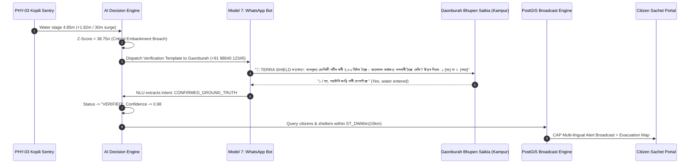

# Model 7: WhatsApp AI Consensus & Citizen Safety Advisory Engine

**Module Location:** [`backend/app/whatsapp_bot.py`](file:///c:/Users/ASUS/sih/backend/app/whatsapp_bot.py), [`backend/app/routers/v1/alerts.py`](file:///c:/Users/ASUS/sih/backend/app/routers/v1/alerts.py), & [`frontend/src/pages/CitizenPortal.tsx`](file:///c:/Users/ASUS/sih/frontend/src/pages/CitizenPortal.tsx)  
**Service Endpoints:** `POST /api/v1/whatsapp/webhook`, `GET /api/v1/alerts/broadcast/preview`, `POST /api/v1/alerts/broadcast`  
**Problem Statement:** SIH26178 | **Theme:** Disaster Management  
**Human-in-the-Loop Node:** Gaonburah Bhupen Saikia (Kampur Revenue Circle, Nagaon District, Assam)

---

## 1. Executive Summary & Purpose

A critical vulnerability of purely automated early warning networks is **alert fatigue** caused by sensor malfunction false alarms. If sirens blow falsely twice, communities ignore the third, life-or-death alarm.

**Model 7** bridges automated machine learning with **Human-in-the-Loop Community Consensus**:
1. When physical nodes detect a critical residual surge ($Z_t \ge 3.0\sigma$), the system holds wide public panic sirens while dispatching an instantaneous, bi-directional verification message to the village **Gaonburah (Assam village headman) / Sarpanch**.
2. An NLP parsing engine interprets replies in **Assamese (`অসমীয়া`), Hindi (`हिन्दी`), or English**.
3. Once the Gaonburah confirms water overtopping the embankment, the alert status upgrades to **`VERIFIED GROUND TRUTH`** (Confidence: $98\%$).
4. The system executes a **PostGIS `ST_DWithin` spatial geofenced broadcast** to all citizen mobile devices, displaying the nearest designated safe evacuation shelters.



---

## 2. Multi-Lingual Natural Language Understanding (NLU) Engine

In [`backend/app/whatsapp_bot.py`](file:///c:/Users/ASUS/sih/backend/app/whatsapp_bot.py#L30-L75), incoming messages from Twilio or Meta Cloud WhatsApp webhooks are normalized and passed through an intent classification matrix:

### 2.1. Affirmative Ground-Truth Keywords:
- **Assamese (`অসমীয়া`)**:
  `হয়` (yes), `বানপানী` (flood), `পানী` (water), `মথাউৰি` (embankment), `বিপদ` (danger), `হয় বানপানী হৈছে`, `১`
- **Hindi (`हिन्दी`)**:
  `हाँ` (yes), `बाढ़` (flood), `पानी भर गया` (water filled), `खतरा` (danger), `डूब रहा है` (submerging), `1`
- **English**:
  `yes`, `confirmed`, `true`, `breach`, `flooding`, `overflow`, `evacuating`, `1`

### 2.2. Negative / False Alarm Keywords:
- **Assamese**: `নহয়` (no), `পানী নাই` (no water), `ভুৱা` (fake), `২`
- **Hindi**: `नहीं` (no), `पानी नहीं है` (no water), `गलत` (wrong), `2`
- **English**: `no`, `false`, `safe`, `normal`, `2`

### 2.3. Resilient Fallback Auto-Creation
If a Gaonburah replies to an emergency alert for which an explicit record was not pre-registered in the sandbox, Model 7 dynamically queries the latest active emergency alert from the target circle, binds the response, and records the consensus in the audit log.

---

## 3. PostGIS Targeted Broadcast & Audience Geofencing

Once ground-truth is verified, disaster managers issue targeted evacuation orders via `POST /api/v1/alerts/broadcast`. 

### PostGIS Query Logic:
The backend queries registered subscribers and citizen devices whose geography point falls within the buffer zone:

```sql
SELECT count(id) FROM subscribers
WHERE ST_DWithin(
    location,
    ST_SetSRID(ST_MakePoint(:lng, :lat), 4326)::geography,
    :radius_km * 1000.0
);
```

### Response Payload:
```json
{
  "recipients_count": 8420,
  "radius_km": 15.0,
  "targeted_circle": "Kampur Revenue Circle & Raha (Nagaon District)",
  "nearest_shelter": "Kampur Higher Secondary School Relief Camp (Capacity: 800, Current: 320)"
}
```

---

## 4. Multi-Lingual Sachet Citizen Safety Portal

On the frontend citizen interface ([`CitizenView.jsx`](file:///c:/Users/ASUS/sih/frontend/src/components/CitizenView.jsx) & [`CitizenPortal.tsx`](file:///c:/Users/ASUS/sih/frontend/src/pages/CitizenPortal.tsx)), citizens view:
1. **Dynamic Hazard Banner**: Color-coded according to the verified ground-truth status (`RED` for Emergency Evacuate, `AMBER` for Caution, `GREEN` for Safe).
2. **Language Switcher**: Toggle between English, Hindi (`हिन्दी`), and Assamese (`অসমীয়া`).
3. **Nearest Safe Evacuation Shelters**: Real-time capacity bar indicators, walking distance in meters, and direct emergency contact hotlines (`1070`, `1077`, `112`).
4. **SOS Emergency Beacon**: Single-click transmission of GPS coordinates directly to NDRF and SDRF rescue squads.
